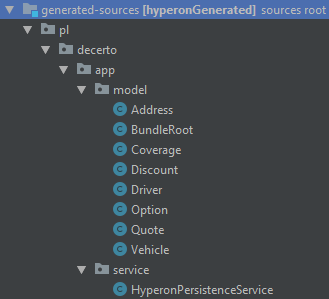

<h1>Basic usage of Hyperon Persistence</h1>
<h3>Structure of generated-source</h3>
Let's first examine <b>generated-sources</b> structure, after launching code generation using gradle plugin.
 This is how it should looks like:

    

Package short description
<ul>
    <li><i>pl.decerto.app.model</i> - model classes generated based on <b>bundle.def</b> file</li>
    <li><i>pl.decerto.app.service</i> - helper package with service (facade) for accessing hyperon-persistence functionalities</li>
</ul>

Before we start coding, let's analyze generated service, that will help communicate with Hyperon Peristence mechanism. This service/class
is called <b>HyperonPersistenceService</b>. It expose basic methods, that can be used by developer:
<ul>
    <li><i>create</i> - creates bundle root for the first time</li>
    <li><i>load</i> - loads stored bundle root, by it's id. Id should be stored by other application, for it's later usage.</li>
    <li><i>persist</i> - persists whole bundle root structure(context), and all changes that were done. It supports, CREATE, UPDATE,
    DELETE actions.</li>
    <li><i>diff</i> - this methods helps detect differences between two bundle roots. It returns instance of type
    <i>BundleDiff</i></li>
</ul>
For more details, please read it's javadoc.

<h4>Development hint</h4>
Before any action, especially on <i>persist</i> action, it is a good idea to call and log it:
<code>
    
    bundleRoot.getBundle().print()
</code>
It will display full bundle structure with values. This method is very helpful especially at the beginning of development.