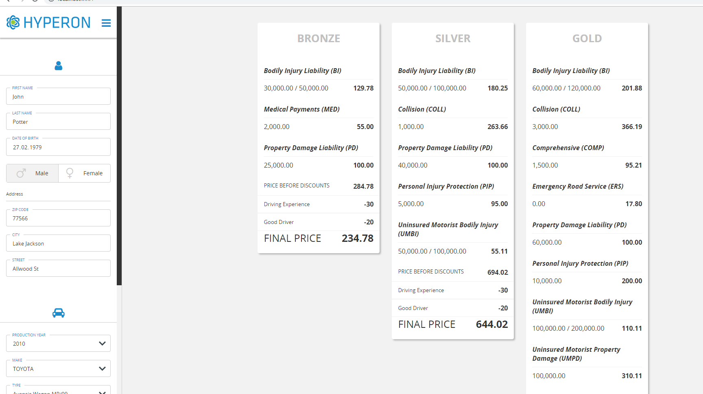
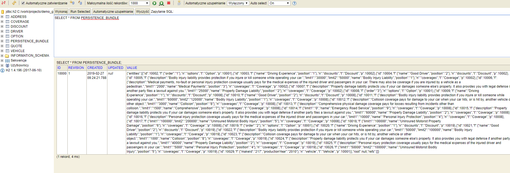
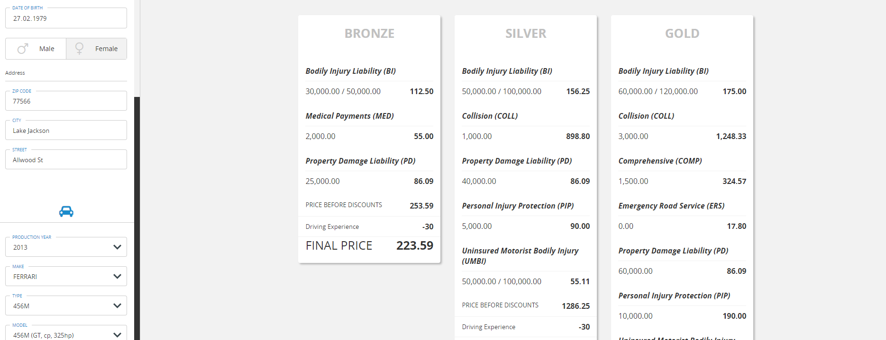
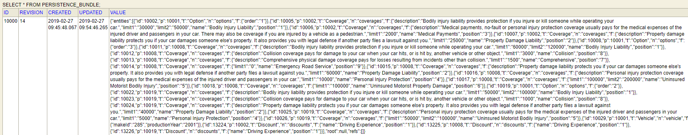

<h3>End result</h3>

This is how end product of this tutorial should looks like.

<h4>Application</h4>

Screen of main page after it is accessed for the first time. As you can see there are some default values setup.

This is the only view of an application, that is available. All data might be modified and recalculation happens only on few actions, like changing gender or number of accidents.
<h4>Application database</h4>

Now let's examine application database structure and main bundle root. In this project it is table called <i>PERSISTENCE_BUNDLE</i>

Application with modified data

In database, there should be only one entry for the same bundle. Bundle will update it's revision, update column and value(JSON) after recalculation.

